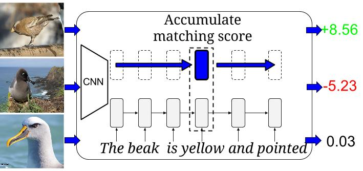

## Learning Deep Representations of Fine-grained Visual Descriptions in PyTorch

PyTorch implementation of [Learning Deep Representations of Fine-grained Visual Descriptions](http://arxiv.org/abs/1605.05395), Scott Reed, Zeynep Akata, Honglak Lee, Bernt Schiele (CVPR16).
The referenced authors' torch code can be found [here](https://github.com/reedscot/cvpr2016).

 
